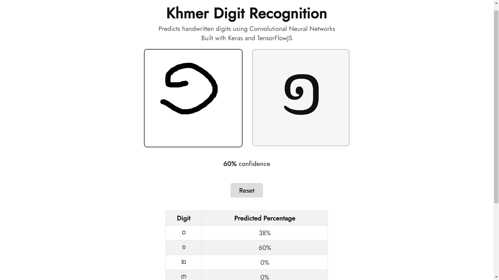

# Khmer Handwritten Digit Classification

## Description

This project is a web application that predicts Khmer handwritten digits using Convolutional Neural Networks (CNN). It is built with Keras and TensorFlowJS, allowing for real-time digit prediction directly within the web browser.

The model was built and trained in Python using the Keras library, then saved using the Tensorflow.js converter.

## Check out the [App Demo](https://rithrita-kong.github.io/khmer-digit-webapp.github.io/)



## Features

- Draw digits on the canvas and get real-time predictions.
- Supports handwritten digits from 0 to 9.
- Displays the predicted digit with confidence percentage.
- Ability to reset the canvas and start over.

## Getting Started

To get a local copy up and running follow these simple steps:

1. Clone the repository:

   ```bash
   git clone https://github.com/Rithrita-Kong/khmer-digit-webapp.github.io.git
   ```

2. Navigate into the project directory:

   ```bash
   cd khmer-digit-webapp.github.io
   ```

3. Open the index.html file in your web browser.
4. Start drawing digits on the canvas and observe the predictions.
